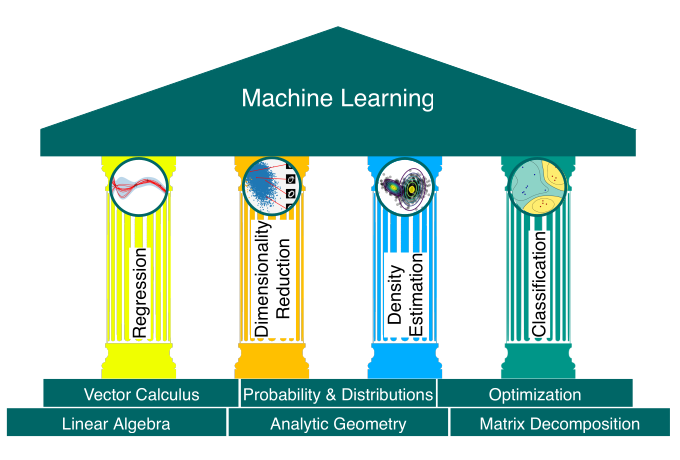
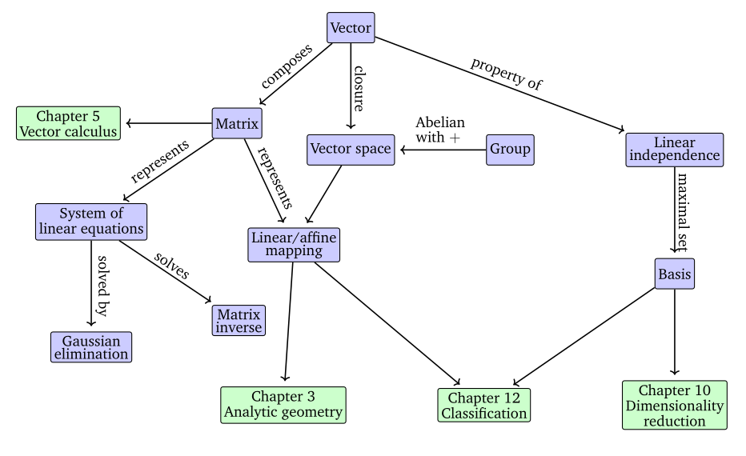

# Part 1: Mathematical Foundations
- [1. Introduction](#1-introduction)
- [2. Linear Algebra](#2-linear-algebra)
- [3. Analytic Geometry](#3-analytic-geometry)
- [4. Matrix Decompositions](#4-matrix-decompositions)
- [5. Vector Calculus](#5-vector-calculus)
- [6. Probability and Distributions](#6-probability-and-distributions)
- [7. Continuous Optimisation](#7-continuous-optimisation)

# Part 2: Central Machine Learning Problems
- [8. When Models Meet Data](#8-when-models-meet-data)
- [9. Linear Regression](#9-linear-regression)
- [10. Dimensionality Reduction with Principal Components Analysis](#10-dimensionality-reduction-with-principal-components-analysis)
- [11. Density Estimation with Gaussian Mixture Models](#11-density-estimation-with-gaussian-mixture-models)
- [12. Classification with Support Vector Machines](#12-classification-with-support-vector-machines)

# 1. Introduction
There are three core consepts of machine learning: 
- data
- model
- learning

Machine learning is generally about designing algorithms that automatically extract valuable information/patterns from *data*. 
To achieve this goal, we design *models*.
*Learning* can be defined as a process of automatic finding of patterns and structure in data by optimizing the parameters of the model.

*Predictors* - ML algorithms that can be defined as systems that make predictions based on the input data.
*Training a system* - a process of using an ML algorithm, that adapts some internal parameters of the predictor so that it performs well on the future unseen input data. 

Three ways to think of a vector:
- An array of numbers (CS view)
- Arrow with a direction and magnitude (Physics view)
- An object that obeys addition and scaling

Main concepts:
- Data is represented as vectors
- Appropriate model is chosen based on the probabilistic or optimisation view
- We learn from available data by using numerical optimisation methods with the aim that the model performs well on data not used for training.

# 2. Linear Algebra
When formalizing intuitive concepts, a common approach is to construct a set of objects (symbols) and a set of rules to manipulate these objects. That's also what *algebra* does.  
Linear algebra is the study of vectors and certain rules to manipulate them.  
In general, vectors are special objects that can be added together and multiplied by scalars to produce another object of the same kind. 

**Scalar** - quantity, that is completely described by its magnitude *(while vectors have both magnitude and direction)*.

Examples of vector object:
1. Geometric vectors
2. Polynomials
3. Audio signals
4. Elements of $\mathbb{R}^n$ (tuples of *n* real numbers)  

## 2.1 Systems of Linear Equations
A vast amount of problems can be formulated as systems of linear equations.  
In general, for a real-valued system of linear equations we obtain either no, axactly one, or infinitely many solutions. 

## 2.2 Matrices
Matrices play a central role in linear algebra. They can be used to compactly represent systems of linear equasions, and they also represent linear functions (linear mappings).  

$$\displaystyle\Large A=\begin{bmatrix} a & b & c \\ 
d & e & f \\ 
g & h & i \end{bmatrix}$$

### 2.2.1 Matrix Addition and Multiplication
### 2.2.2 Inverse and Transpose
### 2.2.3 Multiplication by a Scalar
### 2.2.4 Compact Representations of Systems of linear Equasions

## 2.3 Solving Systems of Linear Equations
## 2.4 Vector Spaces
## 2.5 Linear Independence
## 2.6 Basis and Rank
## 2.7 Linear Mappings
## 2.8 Affine Spaces

# 3. Analytic Geometry
# 4. Matrix Decompositions
# 5. Vector Calculus
# 6. Probability and Distributions
# 7. Continuous Optimisation
# 8. When Models Meet Data
# 9. Linear Regression
# 10. Dimensionality Reduction with Principal Components Analysis
# 11. Density Estimation with Gaussian Mixture Models
# 12. Classification with Support Vector Machines
