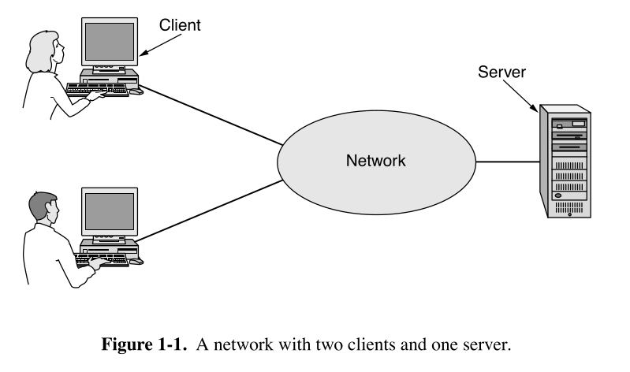
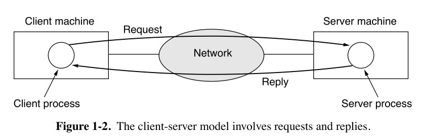
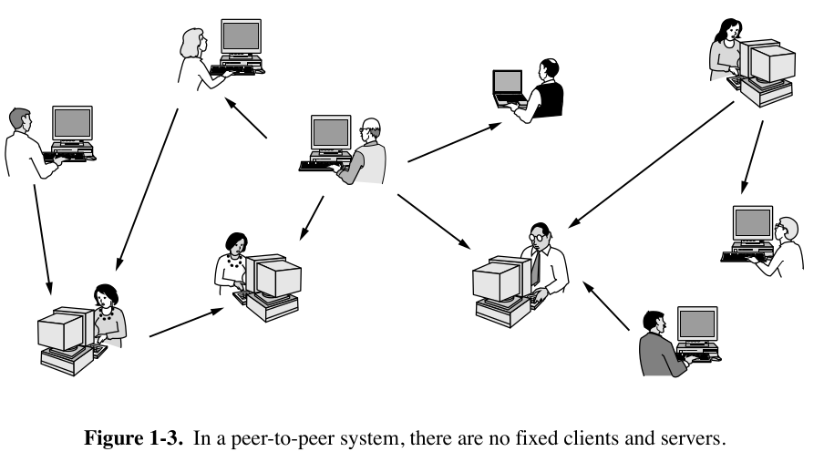

# Table of Contents

1. [Introduction](#1-introduction)  
   1.1 [Uses of Computer Networks](#11-uses-of-computer-networks)  
   1.2 [Types of Computer Networks](#12-types-of-computer-networks)  
   1.3 [Network Technology From Local to Global](#13-network-technology-from-local-to-global)  
   1.4 [Examples of Networks](#14-examples-of-networks)  
   1.5 [Network Protocols](#15-network-protocols)  
   1.6 [Reference Models](#16-reference-models)  
   1.7 [Standardization](#17-standardization)  
   1.8 [Policy Legal and Social Issues](#18-policy-legal-and-social-issues)  
   1.9 [Metric Units](#19-metric-units)  

2. [The Physical Layer](#2-the-physical-layer)  
   2.1 [Guided Transmission Media](#21-guided-transmission-media)  
   2.2 [Wireless Transmission](#22-wireless-transmission)  
   2.3 [Using the Spectrum for Transmission](#23-using-the-spectrum-for-transmission)  
   2.4 [From Waveforms to Bits](#24-from-waveforms-to-bits)  
   2.5 [The Public Switched Telephone Network](#25-the-public-switched-telephone-network)  
   2.6 [Cellular Networks](#26-cellular-networks)  
   2.7 [Cable Networks](#27-cable-networks)  
   2.8 [Communication Satellites](#28-communication-satellites)  
   2.9 [Comparing Different Access Networks](#29-comparing-different-access-networks)  
   2.10 [Policy at the Physical Layer](#210-policy-at-the-physical-layer)  

3. [The Data Link Layer](#3-the-data-link-layer)  
   3.1 [Data Link Layer Design Issues](#31-data-link-layer-design-issues)  
   3.2 [Error Detection and Correction](#32-error-detection-and-correction)  
   3.3 [Elementary Data Link Protocols](#33-elementary-data-link-protocols)  
   3.4 [Improving Efficiency](#34-improving-efficiency)  
   3.5 [Data Link Protocols in Practice](#35-data-link-protocols-in-practice)  

4. [The Medium Access Control Sublayer](#4-the-medium-access-control-sublayer)  

5. [The Network Layer](#5-the-network-layer)  

6. [The Transport Layer](#6-the-transport-layer)  

7. [The Application Layer](#7-the-application-layer)  

8. [Network Security](#8-network-security)  

9. [Further Reading](#9-further-reading)  

---

# 1. Introduction 
## 1.1 Uses of Computer Networks
 **Computer Network** - a collection of     interconnected, autonomous computing devices.
Two computers are said to be interconnected if they can exchange information.
### 1.1.1 Access to Information
Much information on the Internet is accesses using a client-server model, where a client explicitly requests information from a server that hosts that information.

The **client-server model** is widely used and forms the basis of much network usage. The most popular realization of that is a **Web application**.

So, generally, in a *client-server model*, two processes are involved, one on th client machine, and one on the server machine. Communication takes the form of the client process sending a message over the network to the server process. The client process then waits for a reply message while the server process processes the request and sends back a reply.
Another popular model for accessing information is **peer-to-peer** communication. 

The main point is, that there is no division into clients and servers. 
Many *peer-to-peer* systems do not have a central database, but every user maintains a local one, as well as a list of other members of the system.
### 1.1.2 Person-to-Person Communication
### 1.1.3 Electronic Commerce
### 1.1.4 Entertainment 
### 1.1.5 The Internet of Things

## 1.2 Types of Computer Networks
### 1.2.1 Broadband Access Networks
**Metcalfe's law** - the value of a network is proportional to the square of the number of users because this is roughly the number of different connections made.
Today, broadband access networks are proliferating, being delivered through copper (telephone lines), coaxial cable or optical fiber.
### 1.2.2 Mobile and Wireless Access Networks
**Conspectus: Mobile and Wireless Access Networks**

**Key Definitions**
**Mobile and Wireless Networks - Key Terms**

**Mobile Computing**  
Devices designed for portability that can operate while in motion (laptops, smartphones, tablets).

**Wireless Networks**  
Data communication systems using radio waves instead of physical cables (Wi-Fi, Bluetooth, cellular).

**Fixed Wireless**  
Stationary devices connected via wireless signals (e.g., home desktop with Wi-Fi).

**Mobile Wireless**  
Portable devices using wireless connectivity on the move (smartphones, tablets with cellular).

**Hotspot**  
A physical location offering Wi-Fi access, typically through a router (coffee shops, airports).

**Cellular Networks**  
Wireless communication systems divided into geographic "cells" (4G LTE, 5G networks).

**GPS (Global Positioning System)**  
Satellite-based navigation system providing location and time information.

**NFC (Near Field Communication)**
Short-range wireless technology for contactless payments and data transfer (less than 10cm range).

**Sensor Networks**  
Distributed systems of wireless devices that monitor environmental conditions (temperature, motion).

**Key Concepts**

**Mobile vs. Wireless**
- Not all mobile devices use wireless (e.g., plugged-in laptops)
- Not all wireless devices are mobile (e.g., Wi-Fi desktops)

**Major Applications**
- Ride-sharing services (Uber/Lyft)
- Mobile payments and m-commerce
- Inventory tracking in businesses
- Scientific research (animal tracking)
- Military communications

**Core Technologies**
- Wi-Fi (802.11 standards)
- Cellular networks (4G, 5G)
- Short-range wireless (RFID, NFC)
- GPS and location services

**Current Trends**
- Growth of mobile payment systems
- Expansion of IoT devices
- Convergence of phone functionalities
- Development of smarter sensor networks

**Future Directions**
- Next-generation network development (6G)
- Increased AI integration
- Expanded IoT applications
- Improved wireless security protocols

### 1.2.3 Content Provider Networks
Many Internet services are now served from "*the cloud*", or a **data-center network**.
Data center networks server the increasingly growing demands of **cloud computing** and are designed to move large amounts of data between servers in the dat center, as well as between the data center and the rest of the Internet.
**CDN (Content Delivery Network)** - a large collection of servers that are geographically distributed in such a way that content is placed as close as possible to the users that are requesting it. 
### 1.2.4 Transit Networks
Internet travels over many independently operated networks.
Typically, content and applications are hosted in data-center networks, and you may be accessing that content from an access network.
An **access network** is the "last mile" connection between your device (phone, laptop, etc.) and the broader internet. It's the link that gets you online—whether through Wi-Fi, cellular data, or wired broadband.
Your device → Access Network (e.g., Wi-Fi router or cellular tower) → ISP’s Network → Internet Backbone → Websites/Cloud Services.
When the content provider and your **ISP (Internet Service Provider)** are not directly connected, they often rely on a **transit or backbone network** to carry trafic between them.
If content provider and access network exchange enough traffic, they may interconnect directly.
Now we are facing two common trends such as Content Consolidation and ISP expansion.
### 1.2.5. Enterprise Networks

## 1.3 Network Technology, From Local to Global 
### 1.3.1 Personal Area Networks
### 1.3.2 Local Area Networks
### 1.3.3 Home Networks
### 1.3.4 Metropolitan Area Networks
### 1.3.5 Wide Area Networks
### 1.3.6 Internetworks

## 1.4 Examples of Networks 
### 1.4.1 The Internet
### 1.4.2 Mobile Networks
### 1.4.3 Wireless Networks

## 1.5 Network Protocols 
### 1.5.1 Design Goals
### 1.5.2 Protocol Layering
### 1.5.3 Connection and Reliability
### 1.5.4 Service Primitives
### 1.5.5 The Relationship of Services to Protocols

## 1.6 Reference Models 
### 1.6.1 The OSI Reference Model
### 1.6.2 The TCP/IP Reference Model
### 1.6.3 A Critique of the OSI Model and Protocols
### 1.6.4 A Critique of the TCP/IP Reference Model and Protocols
### 1.6.5 The Model Used in This Book

## 1.7 Standardization
### 1.7.1 Standartization and Open Source
### 1.7.2 Who's Who in the Telecommunication World
### 1.7.3 Who's Who in the International Standards World
### 1.7.4 Who's Who in the Internet Standards World  

## 1.8 Policy, Legal, and Social Issues 
### 1.8.1 Online Speech
### 1.8.2 Net Neutrality
### 1.8.3 Security
### 1.8.4 Privacy
### 1.8.5 Disinformation

## 1.9 Metric Units 

# 2. The Physical Layer 
## 2.1 Guided Transmission Media 
## 2.2 Wireless Transmission 
## 2.3 Using the Spectrum for Transmission 
## 2.4 From Waveforms to Bits 
## 2.5 The Public Switched Telephone Network 
## 2.6 Cellular Networks 
## 2.7 Cable Networks 
## 2.8 Communication Satellites 
## 2.9 Comparing Different Access Networks 
## 2.10 Policy at the Physical Layer 

# 3. The Data Link Layer 
## 3.1 Data Link Layer Design Issues 
## 3.2 Error Detection and Correction 
## 3.3 Elementary Data Link Protocols 
## 3.4 Improving Efficiency 
## 3.5 Data Link Protocols in Practice 

# 4. The Medium Access Control Sublayer 

# 5. The Network Layer 

# 6. The Transport Layer 

# 7. The Application Layer 

# 8. Network Security 

# 9. Further Reading 
